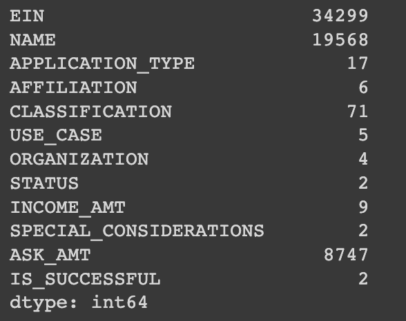
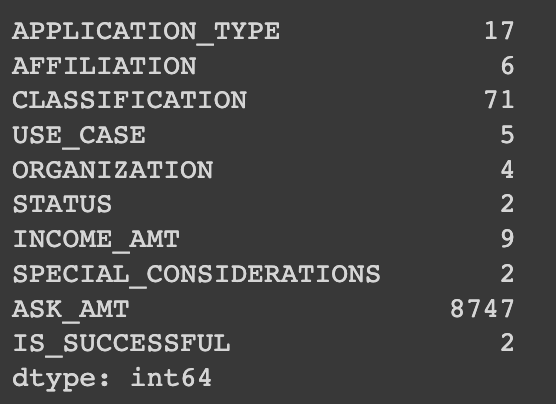
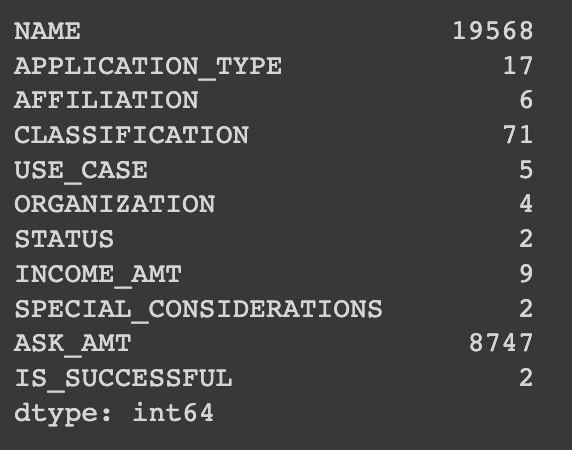
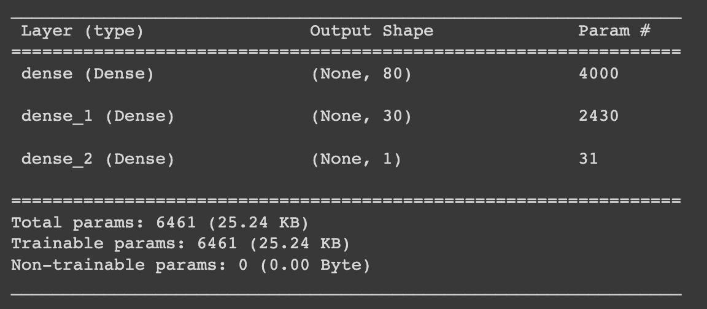
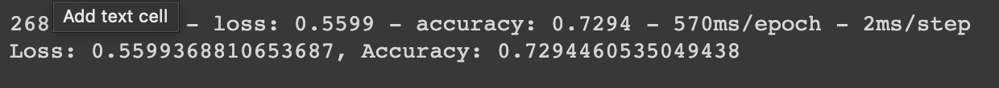
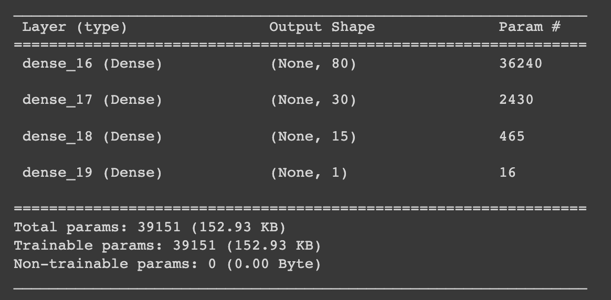
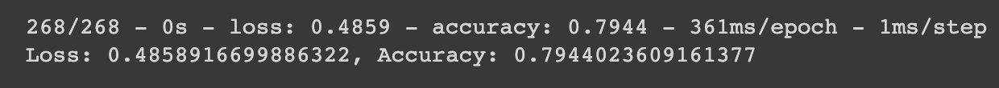
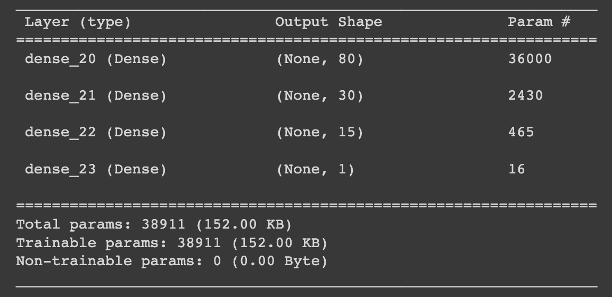
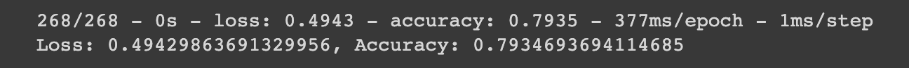

# ***
 Neural Network Report 

***

## ***
 Performnace Analysis of the Deep Learning Model
***

### Overview of the Analysis

Alphabet Soup, a nonprofit foundation, sought a tool to aid in selecting funding applicants with the highest likelihood of success. Leveraging machine learning and neural networks, we used the dataset's features to create a binary classifier for predicting the success of applicants funded by Alphabet Soup.

To optimize the model and achieve a predictive accuracy target exceeding 75%, we performed data preprocessing to ensure that variables or outliers were not causing confusion in the model.

### Results

#### Data Preprocessing

From Alphabet Soup’s business team, CSV containing more than 34,000 organizations that have received funding from Alphabet Soup over the years was given. Within this dataset are a number of columns that capture metadata about each organization, such as:

* EIN and NAME—Identification columns
* APPLICATION_TYPE—Alphabet Soup application type
* AFFILIATION—Affiliated sector of industry
* CLASSIFICATION—Government organization classification
* USE_CASE—Use case for funding
* ORGANIZATION—Organization type
* STATUS—Active status
* INCOME_AMT—Income classification
* SPECIAL_CONSIDERATIONS—Special considerations for application
* ASK_AMT—Funding amount requested
* IS_SUCCESSFUL—Was the money used effectively

In this model "IS_SUCCESSFUL" is the traget variable verified by the value, 1 as considering yes and 0 as no.

    

Excluding 'EIN' and 'NAME' decided 'APPLICATION_TYPE' and 'CLASSIFICATION' for the features of the model and used the number of data points for each unique value to pick a cutoff point to bin "rare" categorical variables together in a new value.

The reason for excluding 'EIN' and 'NAME' is to remove irrelevant information relate to target variable.

To start there are many ways to optmize the model, such as:

* Dropping more or fewer columns.
* Creating more bins for rare occurrences in columns.
* Increasing or decreasing the number of values for each bin.
* Add more neurons to a hidden layer.
* Add more hidden layers.
* Use different activation functions for the hidden layers.
* Add or reduce the number of epochs to the training regimen.

In the first trial non-beneficial ID columns, 'EIN' and 'NAME' was dropped. 

    

However, to increae the target predictive accuracy in the second trial decided to add dropped column back into the dataset.

    

#### Commpiling, Training, and Evaluating the Model

Using the TensorFlow a neural network, or deep learning model, created a binary classification model that can predict if an Alphabet Soup-funded organization will be successful based on the features in the dataset. 

1. First Layer: 80 neurons with a Rectified Linear Unit (ReLU) activation function.
2. Second Layer: 30 neurons with a ReLU activation function, the same as the previous layer.
3. Last Layer: 1 neuron with a Sigmoid activation function.

    

The choice of 80 neurons in the first layer aims to capture complex patterns in the data, but regularization is essential to prevent overfitting. The second layer with 30 neurons reduces model complexity, a common practice in deep networks. The final layer with 1 neuron and sigmoid activation is well-suited for binary classification. (Medium)

    

In the initial attempt, we generated 6,461 parameters with 72% accuracy, falling short of our desired 75% accuracy target.

### Optimization

In our optimization efforts, we reintroduced the 'NAME' column to the dataset and added an extra hidden layer to enhance model performance. 

    

    

This yielded 39,151 parameters and achieved an accuracy of almost 80%.

To identify sources of confusion in the model, we increased the number of bin values. 

    

    

This generated 38,911 parameters and, while still exceeding the 75% target, slightly lagged behind our previous attempt.

### Summary

In summary, our deep learning model, after thorough analysis and optimization, achieved an accuracy of nearly 80% in predicting the success of Alphabet Soup-funded organizations. However, to diversify our approach, I recommend exploring the use of a Random Forest classifier. Random Forest's robustness to irrelevant features, feature importance insights, interpretability, and inherent overfitting mitigation make it a promising alternative. By combining the outputs of both models in an ensemble approach, we can potentially enhance predictive accuracy and provide Alphabet Soup with a more comprehensive tool for selecting funding applicants with the best chance of success.

### Reference

Choubey, Vijay. “Activation Functions in Neural Network: Steps and Implementation.” Medium, CodeX, 6 Feb. 2023, medium.com/codex/activation-functions-in-neural-network-steps-and-implementation-df2e4c858c21. 
